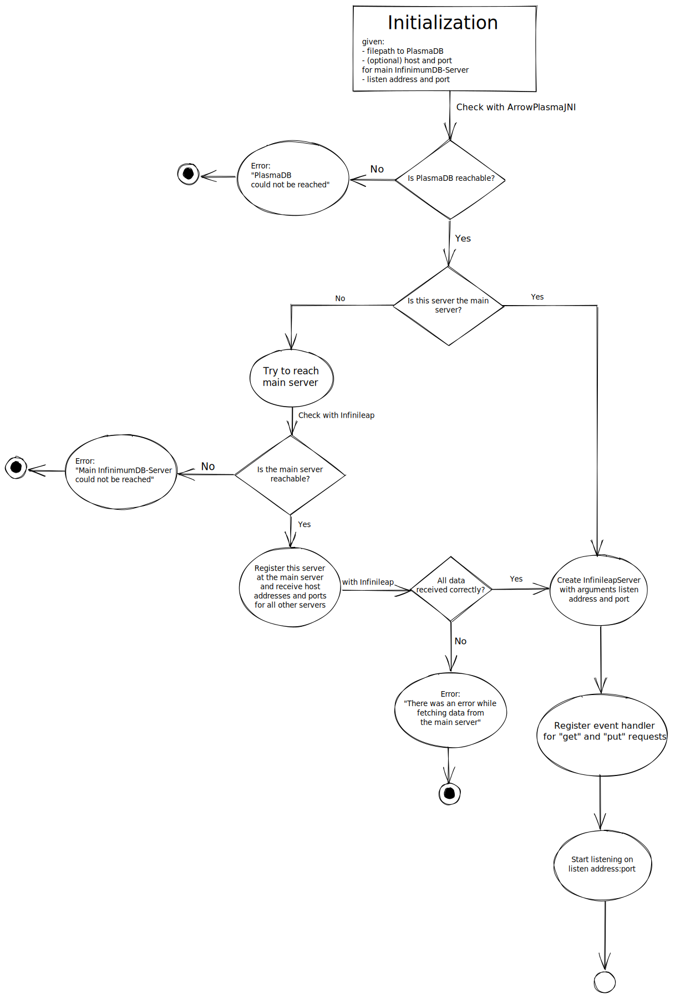
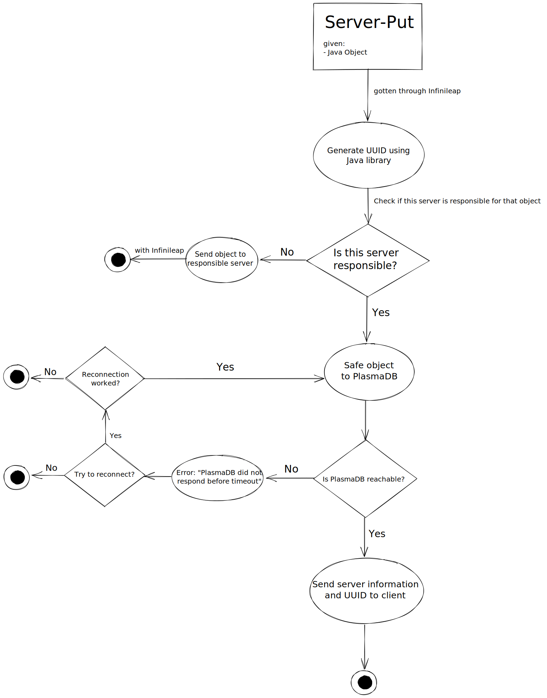

# InfinimumDB-Server





## Prerequisites:
- Install **Apache Arrow JNI** with make:
1. install the latest version of [CMake](https://askubuntu.com/questions/355565/how-do-i-install-the-latest-version-of-cmake-from-the-command-line)
2. run ```sudo apt install python3-numpy```
3. clone Apache Arrow from [GitHub](https://github.com/apache/arrow)
4. run  ```cd arrow/cpp; mkdir release; cd release```
5. find and open the file *arrow/java/plasma/test.sh*
6. copy the options of the *cmake* command
7. run ```sudo cmake ``` followed by the copied options
8. full command should look something like this: 
```bash
   sudo cmake  -DCMAKE_BUILD_TYPE=Release \
   -DCMAKE_C_FLAGS="-g -O3" \
   -DCMAKE_CXX_FLAGS="-g -O3" \
   -DARROW_BUILD_TESTS=off \
   -DARROW_HDFS=on \
   -DARROW_BOOST_USE_SHARED=on \
   -DARROW_PYTHON=on \
   -DARROW_PLASMA=on \
   -DPLASMA_PYTHON=on \
   -DARROW_JEMALLOC=off \
   -DARROW_WITH_BROTLI=off \
   -DARROW_WITH_LZ4=off \
   -DARROW_WITH_ZLIB=off \
   -DARROW_WITH_ZSTD=off \
   -DARROW_PLASMA_JAVA_CLIENT=on \
   ..
```
9. run ```sudo make VERBOSE=1 -j4; sudo make install```
10. run ```sudo cp -a release/. /usr/lib```

## Known Bugs/Problems:
**Problem:** 
Following error message appears when starting a server:
```bash
Exception in thread "main" java.lang.UnsatisfiedLinkError: no plasma_java in java.library.path: /usr/java/packages/lib:/usr/lib64:/lib64:/lib:/usr/lib
```
**Solution:** You need to install the Apache Arrow JNI, follow the Prerequisites for that.

**Problem:**
Following error message appears when running cmake to install Apache Arrow JNI:
```bash
CMake Error at /usr/share/cmake-3.18/Modules/FindPackageHandleStandardArgs.cmake:165 (message): Could NOT find Python3 (missing: Python3_NumPy_INCLUDE_DIRS NumPy) (found version "3.9.7")
```
**Solution:** run ```sudo apt install python3-numpy```
