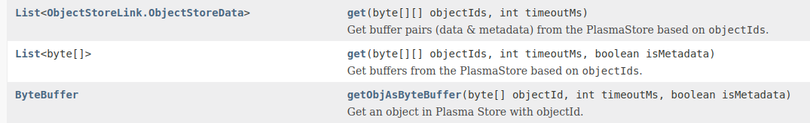
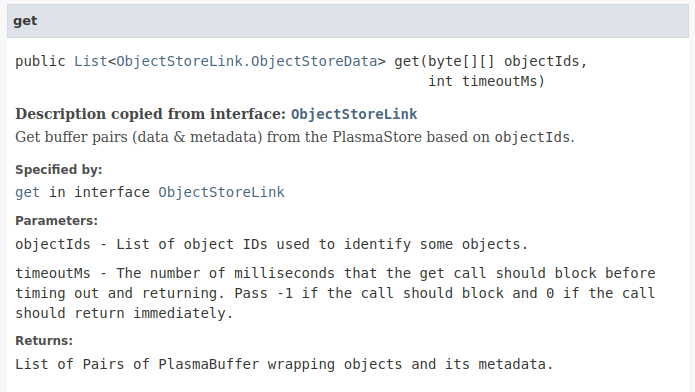
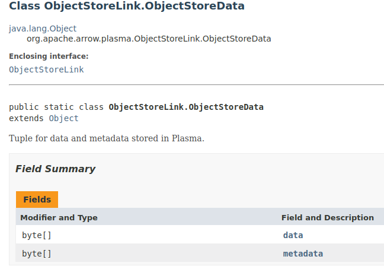
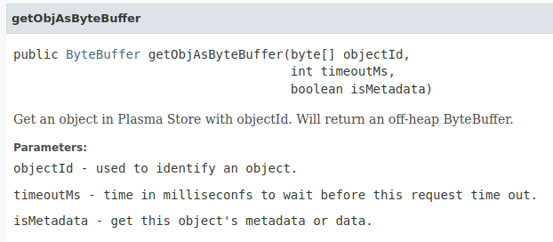
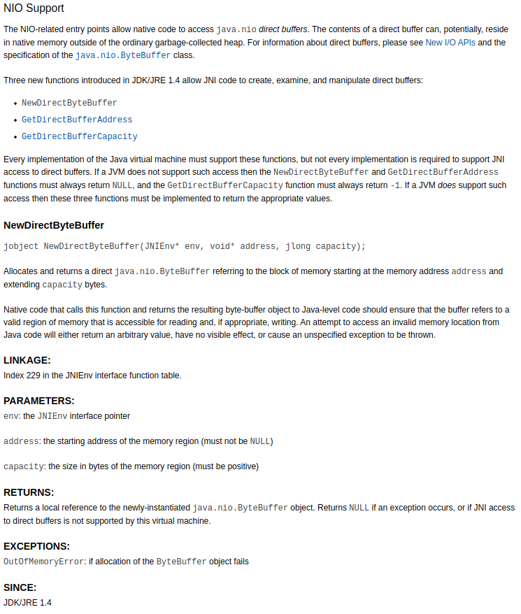

##Question: How does the Plasma JNI get work? Do I get the real memory object or just a copy? 

> :copyright: All code in this document is either from Apache: 
> 
>Licensed to the Apache Software Foundation (ASF) under one
or more contributor license agreements.  See the NOTICE file 
distributed with this work for additional information
regarding copyright ownership.  The ASF licenses this file
to you under the Apache License, Version 2.0 (the
"License"); you may not use this file except in compliance
with the License.  You may obtain a copy of the License at
  http://www.apache.org/licenses/LICENSE-2.0
Unless required by applicable law or agreed to in writing,
software distributed under the License is distributed on an
"AS IS" BASIS, WITHOUT WARRANTIES OR CONDITIONS OF ANY
KIND, either express or implied.  See the License for the
specific language governing permissions and limitations
under the License.
> 
> or Oracle

[JavaDoc](https://arrow.apache.org/docs/java/reference/org/apache/arrow/plasma/package-summary.html)



There are three get methods:
1. ```java
   public List<ObjectStoreLink.ObjectStoreData> get(byte[][] objectIds, int timeoutMs)
   ```
   - Gets a two-dimensional byte array and an integer as arguments. The byte array holds one or more
   object id's, the integer is the timeout in milliseconds. 
   - Returns a list of ObjectStoreLink.ObjectStoreData
   objects which are data metadata tuples corresponding to the given id's.
   
   
   
   
2. ```java
   public List<byte[]> get(byte[][] objectIds, int timeoutMs, boolean isMetadata)
   ```
   - Gets a two-dimensional byte array, an integer and a boolean as arguments. The byte array holds one or more
     object id's, the integer is the timeout in milliseconds and the boolean determines if data or metadata is returned.
   - Returns a list of byte arrays which are data or metadata corresponding to the given id's and boolean.

   

3. ```java
   public ByteBuffer getObjAsByteBuffer(byte[] objectId, int timeoutMs, boolean isMetadata)
   ```
   - Gets a <ins>one-dimensional</ins> byte array, an integer and a boolean as arguments. The byte array holds <ins>one
     object id</ins>, the integer is the timeout in milliseconds and the boolean determines if data or metadata is returned.
   - Returns a java ByteBuffer object which contains data or metadata corresponding to the given id and boolean.
   


---

[SourceCode](https://github.com/apache/arrow/tree/4ef95eb89f9202dfcd9017633cf55671d56e337f/java/plasma)

PlasmaClient:

1. 
```java
@Override
public List<ObjectStoreData> get(byte[][] objectIds, int timeoutMs) {
ByteBuffer[][] bufs = PlasmaClientJNI.get(conn, objectIds, timeoutMs);
assert bufs.length == objectIds.length;

    List<ObjectStoreData> ret = new ArrayList<>();
    for (int i = 0; i < bufs.length; i++) {
      ByteBuffer databuf = bufs[i][0];
      ByteBuffer metabuf = bufs[i][1];
      if (databuf == null) {
        ret.add(new ObjectStoreData(null, null));
      } else {
        byte[] data = new byte[databuf.remaining()];
        databuf.get(data);
        byte[] meta;
        if (metabuf != null) {
          meta = new byte[metabuf.remaining()];
          metabuf.get(meta);
        } else {
          meta = null;
        }
        ret.add(new ObjectStoreData(meta, data));
      }
    }
    return ret;
}
```

2. 
```java
  @Override
  public List<byte[]> get(byte[][] objectIds, int timeoutMs, boolean isMetadata) {
    ByteBuffer[][] bufs = PlasmaClientJNI.get(conn, objectIds, timeoutMs);
    assert bufs.length == objectIds.length;

    List<byte[]> ret = new ArrayList<>();
    for (int i = 0; i < bufs.length; i++) {
      ByteBuffer buf = bufs[i][isMetadata ? 1 : 0];
      if (buf == null) {
        ret.add(null);
      } else {
        byte[] bb = new byte[buf.remaining()];
        buf.get(bb);
        ret.add(bb);
      }
    }
    return ret;
  }
```

3.
```java
 /**
   * Get an object in Plasma Store with objectId. Will return an off-heap ByteBuffer.
   *
   * @param objectId used to identify an object.
   * @param timeoutMs time in milliseconfs to wait before this request time out.
   * @param isMetadata get this object's metadata or data.
   */
  public ByteBuffer getObjAsByteBuffer(byte[] objectId, int timeoutMs, boolean isMetadata) {
    byte[][] objectIds = new byte[][]{objectId};
    ByteBuffer[][] bufs = PlasmaClientJNI.get(conn, objectIds, timeoutMs);
    return bufs[0][isMetadata ? 1 : 0];
  }
```


PlasmaClientJNI:
```java
public static native ByteBuffer[][] get(long conn, byte[][] objectIds, int timeoutMs);
```

C++ file [org_apache_arrow_plasma_PlasmaClientJNI.cc](https://github.com/apache/arrow/blob/ce23c06469de9cf0c3e38e35cdb8d135f341b964/cpp/src/plasma/lib/java/org_apache_arrow_plasma_PlasmaClientJNI.cc)

```cpp
JNIEXPORT jobjectArray JNICALL Java_org_apache_arrow_plasma_PlasmaClientJNI_get(
    JNIEnv* env, jclass cls, jlong conn, jobjectArray object_ids, jint timeout_ms) {
  plasma::PlasmaClient* client = reinterpret_cast<plasma::PlasmaClient*>(conn);

  jsize num_oids = env->GetArrayLength(object_ids);
  std::vector<plasma::ObjectID> oids(num_oids);
  std::vector<plasma::ObjectBuffer> obufs(num_oids);
  for (int i = 0; i < num_oids; ++i) {
    jbyteArray_to_object_id(
        env, reinterpret_cast<jbyteArray>(env->GetObjectArrayElement(object_ids, i)),
        &oids[i]);
  }
  // TODO: may be blocked. consider to add the thread support
  ARROW_CHECK_OK(client->Get(oids.data(), num_oids, timeout_ms, obufs.data()));

  jclass clsByteBuffer = env->FindClass("java/nio/ByteBuffer");
  jclass clsByteBufferArray = env->FindClass("[Ljava/nio/ByteBuffer;");

  jobjectArray ret = env->NewObjectArray(num_oids, clsByteBufferArray, nullptr);
  jobjectArray o = nullptr;
  jobject dataBuf, metadataBuf;
  for (int i = 0; i < num_oids; ++i) {
    o = env->NewObjectArray(2, clsByteBuffer, nullptr);
    if (obufs[i].data && obufs[i].data->size() != -1) {
      dataBuf = env->NewDirectByteBuffer(const_cast<uint8_t*>(obufs[i].data->data()),
                                         obufs[i].data->size());
      if (obufs[i].metadata && obufs[i].metadata->size() > 0) {
        metadataBuf = env->NewDirectByteBuffer(
            const_cast<uint8_t*>(obufs[i].metadata->data()), obufs[i].metadata->size());
      } else {
        metadataBuf = nullptr;
      }
    } else {
      dataBuf = nullptr;
      metadataBuf = nullptr;
    }

    env->SetObjectArrayElement(o, 0, dataBuf);
    env->SetObjectArrayElement(o, 1, metadataBuf);
    env->SetObjectArrayElement(ret, i, o);
  }
  return ret;
}
```

NewDirectByteBuffer [oracle docs](https://docs.oracle.com/javase/8/docs/technotes/guides/jni/spec/functions.html#NewDirectByteBuffer)



C++ [PlasmaClient](https://github.com/apache/arrow/blob/8e43f23dcc6a9e630516228f110c48b64d13cec6/cpp/src/plasma/client.cc)
```cpp
Status PlasmaClient::Impl::Get(const std::vector<ObjectID>& object_ids,
                               int64_t timeout_ms, std::vector<ObjectBuffer>* out) {
  std::lock_guard<std::recursive_mutex> guard(client_mutex_);

  const auto wrap_buffer = [=](const ObjectID& object_id,
                               const std::shared_ptr<Buffer>& buffer) {
    return std::make_shared<PlasmaBuffer>(shared_from_this(), object_id, buffer);
  };
  const size_t num_objects = object_ids.size();
  *out = std::vector<ObjectBuffer>(num_objects);
  return GetBuffers(&object_ids[0], num_objects, timeout_ms, wrap_buffer, &(*out)[0]);
}

Status PlasmaClient::Impl::Get(const ObjectID* object_ids, int64_t num_objects,
                               int64_t timeout_ms, ObjectBuffer* out) {
  std::lock_guard<std::recursive_mutex> guard(client_mutex_);

  const auto wrap_buffer = [](const ObjectID& object_id,
                              const std::shared_ptr<Buffer>& buffer) { return buffer; };
  return GetBuffers(object_ids, num_objects, timeout_ms, wrap_buffer, out);
}

Status PlasmaClient::Impl::GetBuffers(
    const ObjectID* object_ids, int64_t num_objects, int64_t timeout_ms,
    const std::function<std::shared_ptr<Buffer>(
        const ObjectID&, const std::shared_ptr<Buffer>&)>& wrap_buffer,
    ObjectBuffer* object_buffers) {
  // Fill out the info for the objects that are already in use locally.
  bool all_present = true;
  for (int64_t i = 0; i < num_objects; ++i) {
    auto object_entry = objects_in_use_.find(object_ids[i]);
    if (object_entry == objects_in_use_.end()) {
      // This object is not currently in use by this client, so we need to send
      // a request to the store.
      all_present = false;
    } else if (!object_entry->second->is_sealed) {
      // This client created the object but hasn't sealed it. If we call Get
      // with no timeout, we will deadlock, because this client won't be able to
      // call Seal.
      ARROW_CHECK(timeout_ms != -1)
          << "Plasma client called get on an unsealed object that it created";
      ARROW_LOG(WARNING)
          << "Attempting to get an object that this client created but hasn't sealed.";
      all_present = false;
    } else {
      PlasmaObject* object = &object_entry->second->object;
      std::shared_ptr<Buffer> physical_buf;

      if (object->device_num == 0) {
        uint8_t* data = LookupMmappedFile(object->store_fd);
        physical_buf = std::make_shared<Buffer>(
            data + object->data_offset, object->data_size + object->metadata_size);
      } else {
#ifdef PLASMA_CUDA
        std::lock_guard<std::mutex> lock(gpu_mutex);
        auto iter = gpu_object_map.find(object_ids[i]);
        ARROW_CHECK(iter != gpu_object_map.end());
        iter->second->client_count++;
        physical_buf = MakeBufferFromGpuProcessHandle(iter->second);
#else
        ARROW_LOG(FATAL) << "Arrow GPU library is not enabled.";
#endif
      }
      physical_buf = wrap_buffer(object_ids[i], physical_buf);
      object_buffers[i].data = SliceBuffer(physical_buf, 0, object->data_size);
      object_buffers[i].metadata =
          SliceBuffer(physical_buf, object->data_size, object->metadata_size);
      object_buffers[i].device_num = object->device_num;
      // Increment the count of the number of instances of this object that this
      // client is using. Cache the reference to the object.
      IncrementObjectCount(object_ids[i], object, true);
    }
  }

  if (all_present) {
    return Status::OK();
  }
  
  // If we get here, then the objects aren't all currently in use by this
  // client, so we need to send a request to the plasma store.
  RETURN_NOT_OK(SendGetRequest(store_conn_, &object_ids[0], num_objects, timeout_ms));
  std::vector<uint8_t> buffer;
  RETURN_NOT_OK(PlasmaReceive(store_conn_, MessageType::PlasmaGetReply, &buffer));
  std::vector<ObjectID> received_object_ids(num_objects);
  std::vector<PlasmaObject> object_data(num_objects);
  PlasmaObject* object;
  std::vector<int> store_fds;
  std::vector<int64_t> mmap_sizes;
  RETURN_NOT_OK(ReadGetReply(buffer.data(), buffer.size(), received_object_ids.data(),
                             object_data.data(), num_objects, store_fds, mmap_sizes));

  // We mmap all of the file descriptors here so that we can avoid look them up
  // in the subsequent loop based on just the store file descriptor and without
  // having to know the relevant file descriptor received from recv_fd.
  for (size_t i = 0; i < store_fds.size(); i++) {
    int fd = GetStoreFd(store_fds[i]);
    LookupOrMmap(fd, store_fds[i], mmap_sizes[i]);
  }

  for (int64_t i = 0; i < num_objects; ++i) {
    DCHECK(received_object_ids[i] == object_ids[i]);
    object = &object_data[i];
    if (object_buffers[i].data) {
      // If the object was already in use by the client, then the store should
      // have returned it.
      DCHECK_NE(object->data_size, -1);
      // We've already filled out the information for this object, so we can
      // just continue.
      continue;
    }
    // If we are here, the object was not currently in use, so we need to
    // process the reply from the object store.
    if (object->data_size != -1) {
      std::shared_ptr<Buffer> physical_buf;
      if (object->device_num == 0) {
        uint8_t* data = LookupMmappedFile(object->store_fd);
        physical_buf = std::make_shared<Buffer>(
            data + object->data_offset, object->data_size + object->metadata_size);
      } else {
#ifdef PLASMA_CUDA
        std::lock_guard<std::mutex> lock(gpu_mutex);
        auto iter = gpu_object_map.find(object_ids[i]);
        if (iter == gpu_object_map.end()) {
          ARROW_ASSIGN_OR_RAISE(auto context, GetCudaContext(object->device_num));
          GpuProcessHandle* obj_handle = new GpuProcessHandle();
          obj_handle->client_count = 1;
          ARROW_ASSIGN_OR_RAISE(obj_handle->ptr,
                                context->OpenIpcBuffer(*object->ipc_handle));
          gpu_object_map[object_ids[i]] = obj_handle;
          physical_buf = MakeBufferFromGpuProcessHandle(obj_handle);
        } else {
          iter->second->client_count++;
          physical_buf = MakeBufferFromGpuProcessHandle(iter->second);
        }
#else
        ARROW_LOG(FATAL) << "Arrow GPU library is not enabled.";
#endif
      }
      // Finish filling out the return values.
      physical_buf = wrap_buffer(object_ids[i], physical_buf);
      object_buffers[i].data = SliceBuffer(physical_buf, 0, object->data_size);
      object_buffers[i].metadata =
          SliceBuffer(physical_buf, object->data_size, object->metadata_size);
      object_buffers[i].device_num = object->device_num;
      // Increment the count of the number of instances of this object that this
      // client is using. Cache the reference to the object.
      IncrementObjectCount(received_object_ids[i], object, true);
    } else {
      // The object was not retrieved.  The caller can detect this condition
      // by checking the boolean value of the metadata/data buffers.
      DCHECK(!object_buffers[i].metadata);
      DCHECK(!object_buffers[i].data);
    }
  }
  return Status::OK();
}
```